# Recruitment ML

## Introduction

This project is a simple web app dedicated to recruitment. It allows companies to post job offers, candidates to apply, and recruiters to view regression/classification figures based on salary suggestions, years of experience, and possession of a degree.

## Technologies

- Python: The main programming language for the backend and data analysis.
- Flask: A Python web framework used to develop the backend of the application.
- MongoDB: A NoSQL database used to store data related to job offers and applications.
- pymongo: A Python library for interacting with MongoDB from the Flask application.
- Marshmallow: A Python library used for schema validation and data serialization.
- scikit-learn: A Python library for machine learning tools, used to generate regression and classification figures.
- Matplotlib: A Python library for creating graphs, used to visualize the generated figures.
- NumPy: A Python library for numerical calculations, often used in conjunction with scikit-learn.

These technologies were chosen for their efficiency in software development, data manipulation, and creating machine learning models.

## Tables and Relationships

| Job | Application |
|-----|-----|
| id `PK/uid` | id `PK/uid` |
| title `string` | years_of_experience `number` |
| company `string` | has_diploma `boolean` |
| workspace_type `string` | salary `number` |
| location `string` | email `string` |
| type `string` | cv_url `string` |
| description `string` | job_id `FK/string` |
| email `string` |

`Job.id` 1 - 0..* `Application.job_id`

## UIs

The user interfaces are those of the job posting process on LinkedIn.

1. Job Details
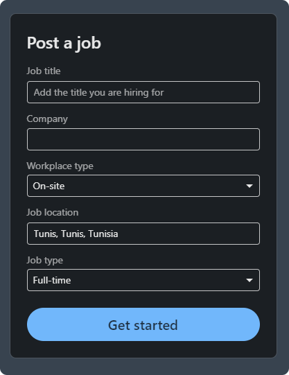

2. Job Description
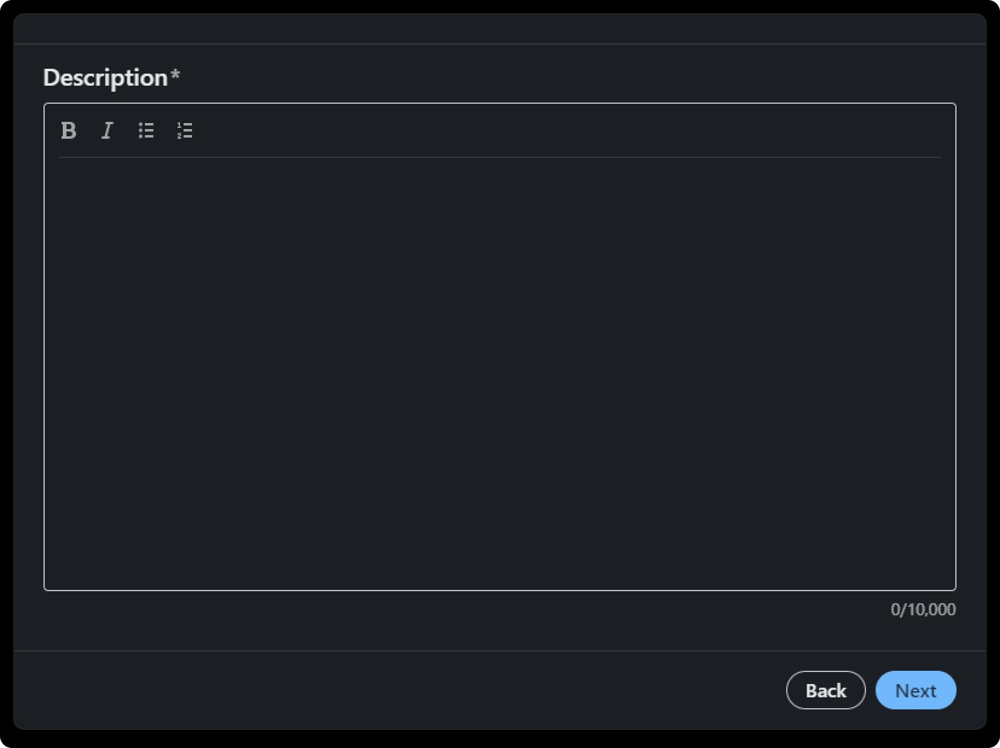

3. Pre-screening Questions
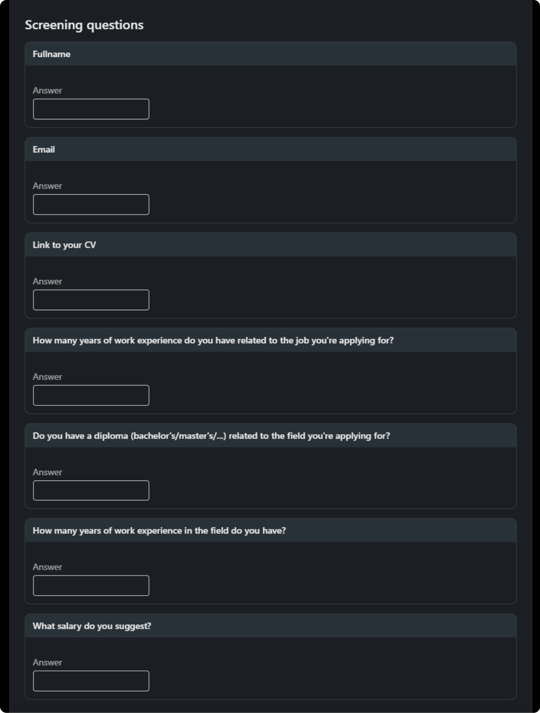

## Backend Endpoints

- `/jobs`:
  - GET `/`:
    Retrieves a list of available jobs from the database.
  - POST `/`:
    Creates a new job posting.
  - POST `/<job_id>/apply`:
    Allows candidates to submit their applications by providing details such as name, years of experience, possession of a degree, salary expectations, email, and a link to their CV.
  - GET `/<job_id>/stats`:
    Retrieves statistics and generates machine learning figures based on the received applications for a specific job. The figures include regression and classification visualizations based on suggested candidates entries (salaries, years of experience, and possession of a degree).

- `/figures`:
  - GET `/<id>`:
    Retrieves the image file of a specific machine learning figure identified by its unique ID.

Example of response using an API client:

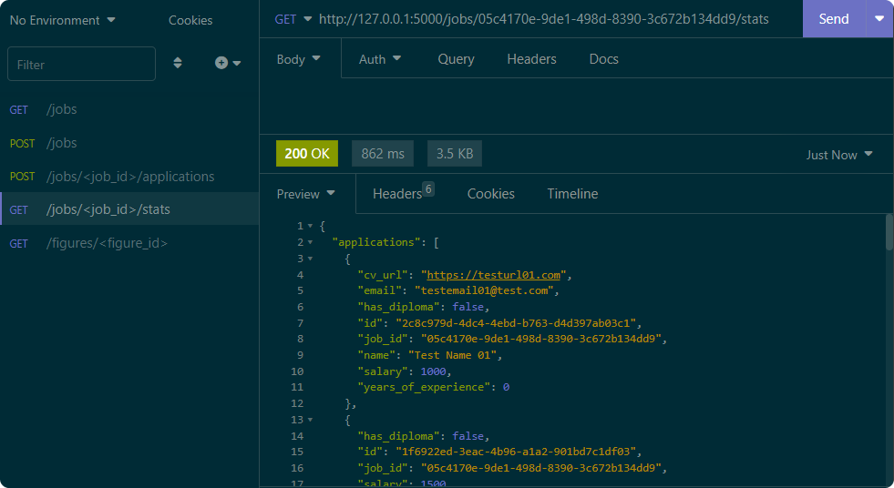

Example data within the Jobs collection:

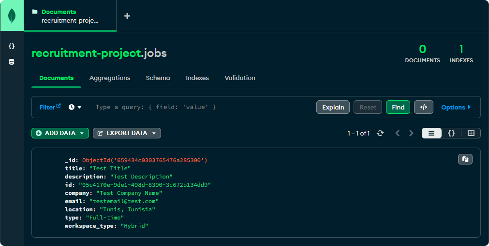

Example data within the Applications collection:

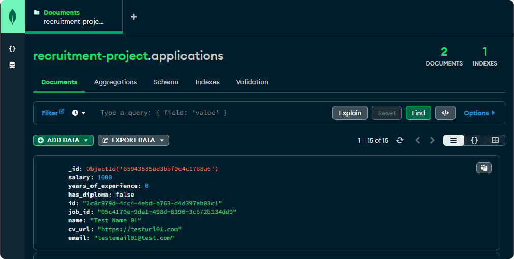

## Figures Types

Three types of figures have been employed in the application:

- Decision Tree for Classification:
The first type of figure showcases a decision tree based on classification data. This tree provides a visual representation of classification criteria, such as years of experience, suggested salaries, and possession of a degree. The nodes of the tree illustrate the decisions made to classify applications based on these criteria.

- Decision Tree for Regression:
The second type presents a decision tree for regression. It is designed to assess the relationships between years of experience and suggested salaries.

- Linear Regression:
In addition to decision trees, we will generate linear regression plots. This third type of figure presents a linear regression line that models the relationship between a specific feature (such as years of experience) and the target variable (suggested salaries). This graphical representation provides an intuitive view of regression and facilitates understanding of linear relationships between variables.

## Figures Visualization

Sample job applications used for demonstration:

```python
[
  {"salary": 1000, "years_of_experience": 0, "has_diploma": False},
  {"salary": 1500, "years_of_experience": 1, "has_diploma": False},
  {"salary": 1700, "years_of_experience": 1, "has_diploma": True},
  {"salary": 1200, "years_of_experience": 0, "has_diploma": False},
  {"salary": 1150, "years_of_experience": 0, "has_diploma": False},
  {"salary": 1800, "years_of_experience": 3, "has_diploma": True},
  {"salary": 1550, "years_of_experience": 1, "has_diploma": False},
  {"salary": 1750, "years_of_experience": 2, "has_diploma": False},
  {"salary": 2200, "years_of_experience": 4, "has_diploma": True},
  {"salary": 2050, "years_of_experience": 5, "has_diploma": True},
  {"salary": 3000, "years_of_experience": 5, "has_diploma": True},
  {"salary": 4000, "years_of_experience": 10, "has_diploma": True},
  {"salary": 3500, "years_of_experience": 8, "has_diploma": True},
  {"salary": 4500, "years_of_experience": 10, "has_diploma": True},
  {"salary": 4200, "years_of_experience": 12, "has_diploma": True},
]
```

We will integrate these three types of figures on eight occasions:

- Decision Tree - Experience (feature) vs Salary (target):
A decision tree based on candidates' years of experience, providing insights into how experience influences suggested salaries.

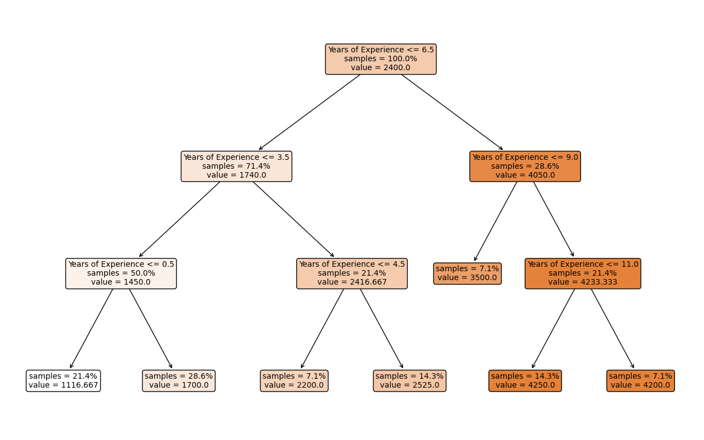

- Decision Tree - Salary vs Experience:
A second decision tree based on suggested salaries, showing how salaries are influenced by candidates' experience.

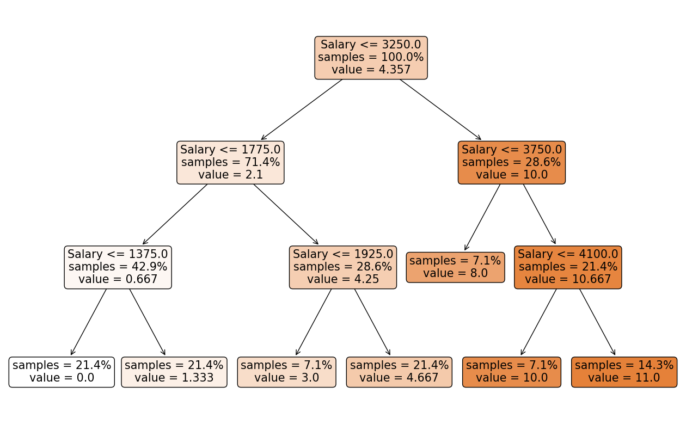

- Decision Tree - Degree vs Experience:
A decision tree analyzing the relationship between possessing a degree and candidates' years of experience.

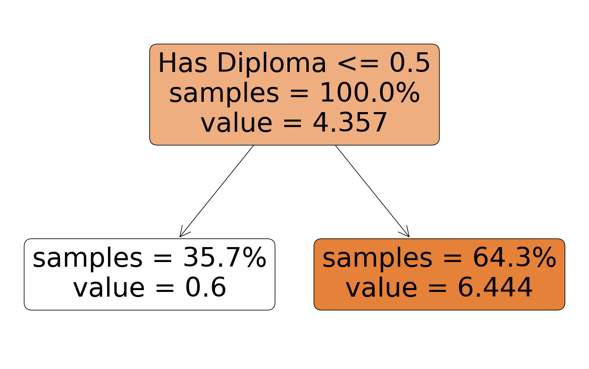

- Decision Tree - Degree vs Salary:
Another decision tree exploring how possessing a degree influences suggested salaries.

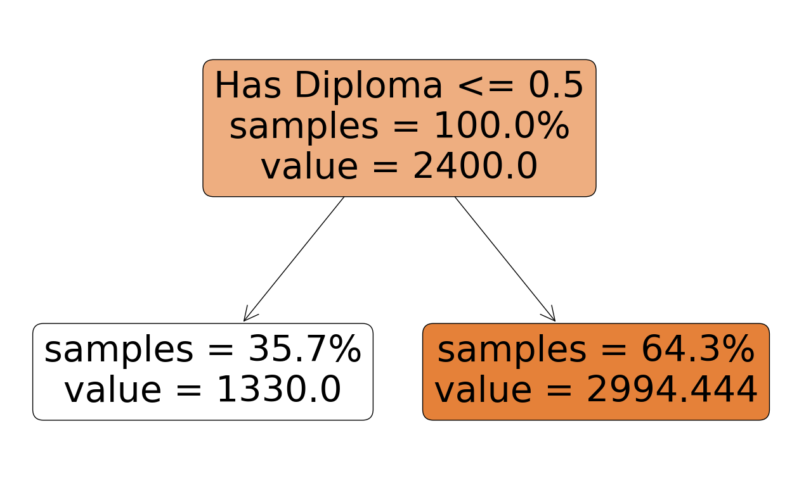

- Decision Tree - Experience vs Degree:
A decision tree classifying applications based on experience and indicating the relationship with possessing a degree.

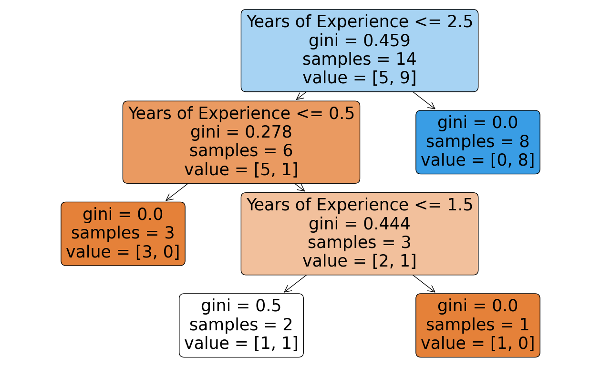

Explanation: the value = [3, 0] indicates that there are 0 samples with the target class (has a degree) True and 3 samples with the target class False. This means that 3 do not have degrees in the field, and 0 do.

- Decision Tree - Salary vs Degree:
A decision tree analyzing the relationship between suggested salaries and possessing a degree.

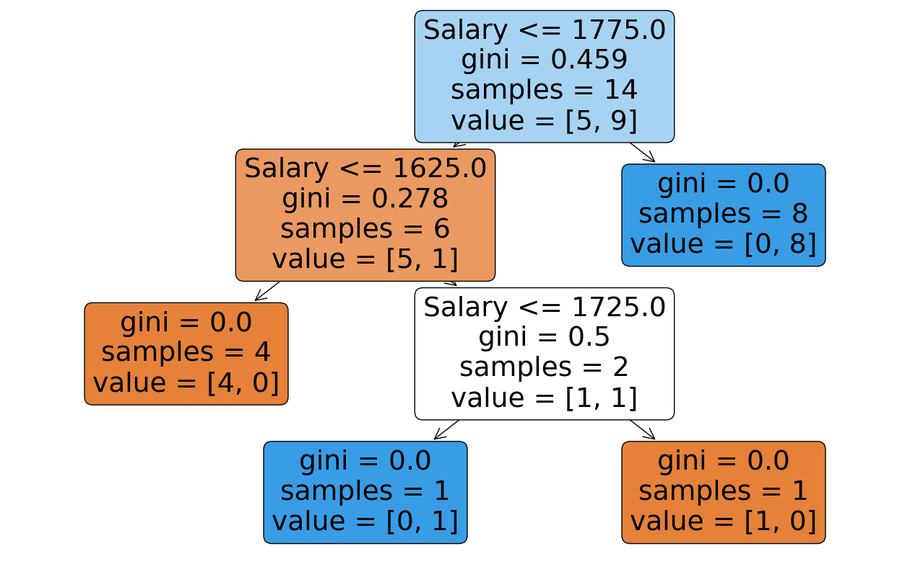

- Linear Regression - Experience vs Salary:
A linear regression plot illustrating the relationship between experience and suggested salaries, with a prediction range from 0 to 20 years of experience.

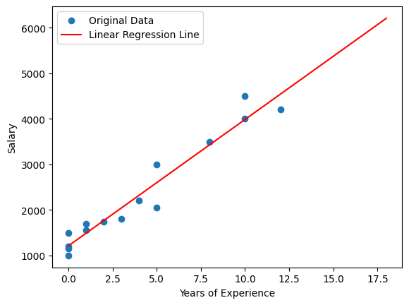

- Linear Regression - Salary vs Experience:
Another linear regression plot presenting the inverse relationship, this time between suggested salaries and candidates' experience, with a salary range from 1000 to 5000.

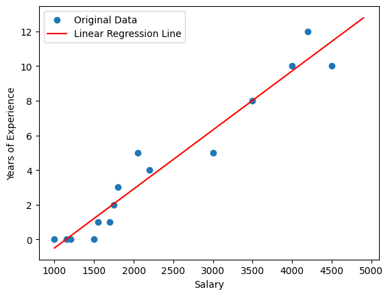
